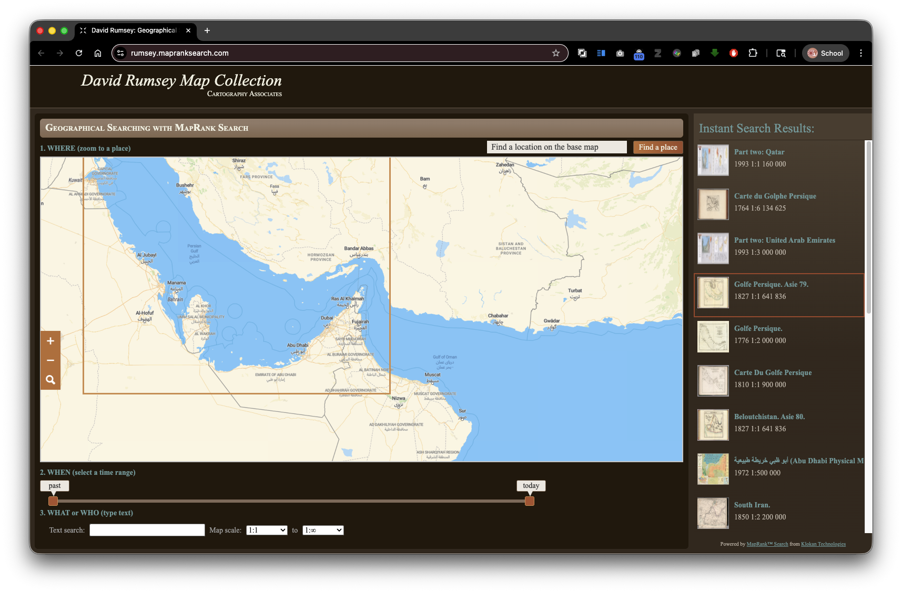
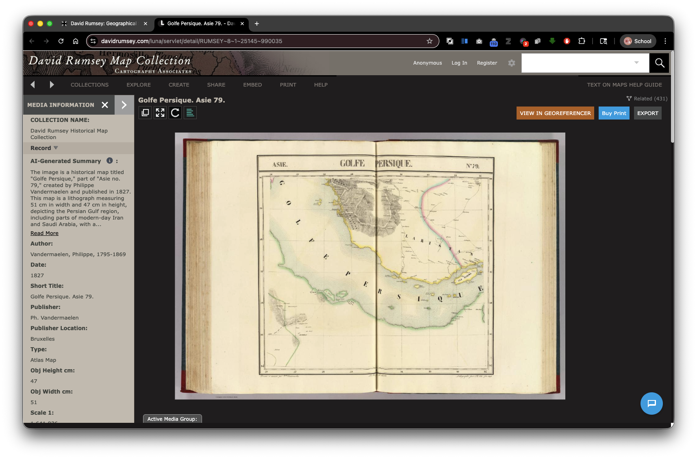
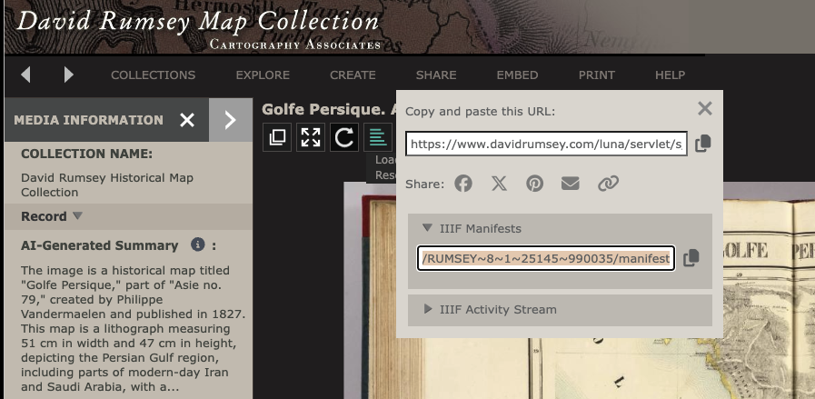
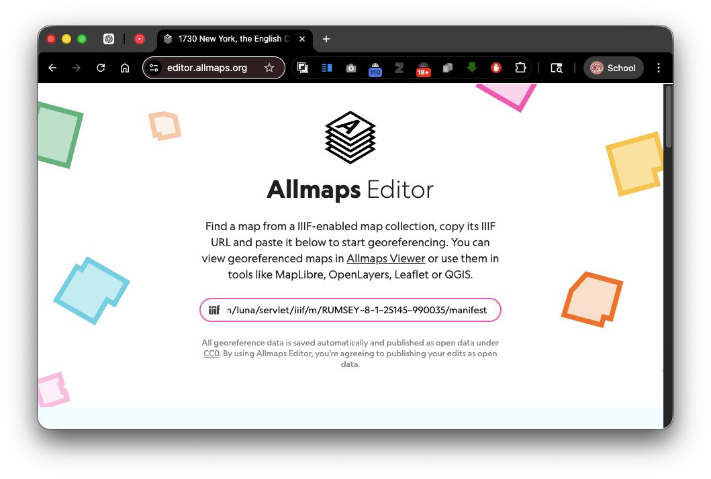
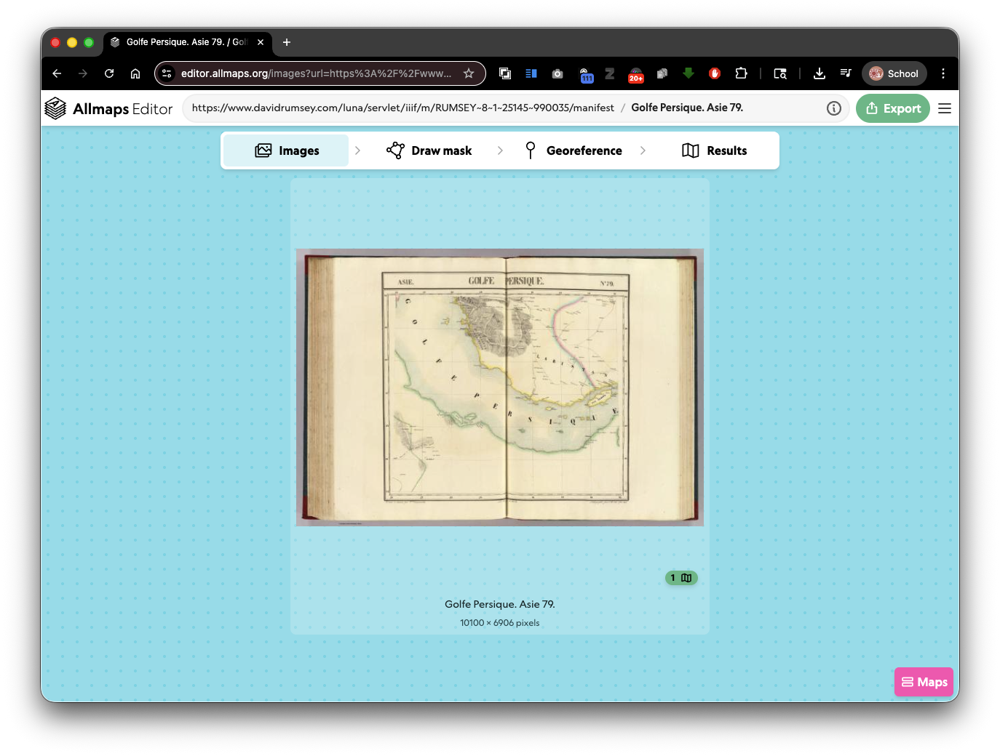
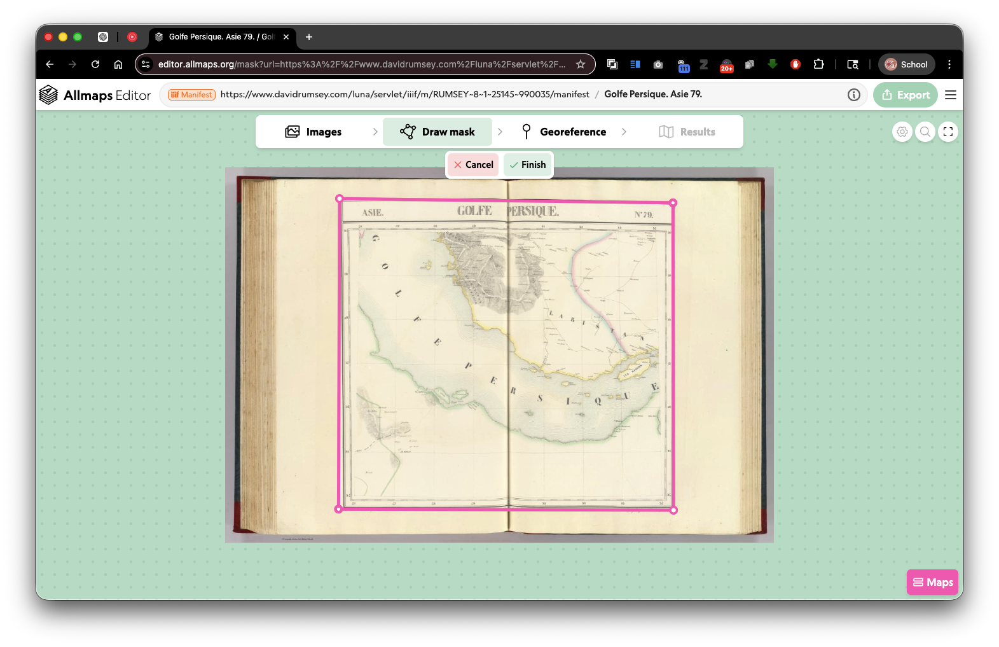
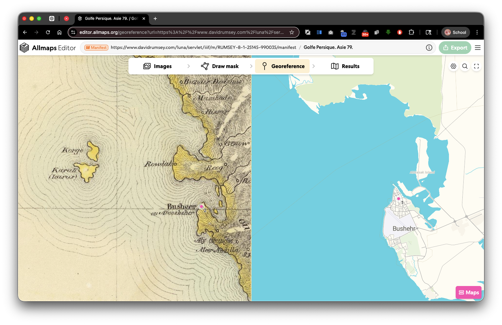
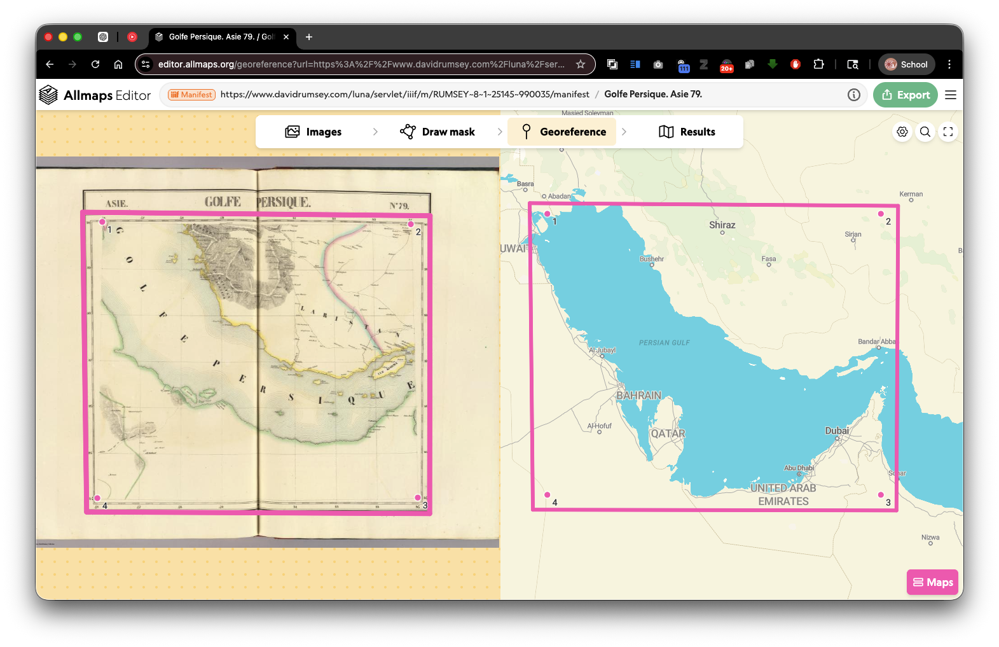

# Workshop: Georeferencing Maps with Allmaps

## A Guide to Converting Historical Maps into Digital Tiles

---

## Part 1: Understanding Georeferencing

### What is Georeferencing?

Georeferencing is the process of aligning a digital image (like a historical map) to real-world geographic coordinates. Here's how it works:

- **Image Coordinates**: The pixel positions on your scanned map or map image (measured in rows and columns)
- **Geographic Coordinates**: Real-world latitude/longitude (or projected coordinate system) locations on Earth
- **Ground Control Points (GCPs)**: Pairs that tie image locations to geographic locations
- **The Goal**: Create a mathematical transformation that converts any pixel location on the map to its corresponding geographic coordinates

### Why Georeferencing Matters

When you georeference a historical map, you unlock its data:

- Overlay it with modern maps to understand how things have changed
- Extract spatial data (buildings, roads, boundaries) that existed in the past
- Make historical maps searchable and interactive in web applications
- Preserve the spatial context of historical information

### Why Use IIIF-Backed Allmaps?

**Advantages over traditional desktop georeferencing software:**

1. **No Derivative Files Required**

   - Traditional tools (ArcGIS, QGIS) require downloading, processing, and storing georeferenced versions of maps
   - Allmaps works with IIIF sources—the original stays on a remote server, you only store the georeferencing data (GCPs and transformation parameters)
   - This saves disk space and eliminates version control issues
2. **Instant Access to Millions of Maps**

   - Davidrumsey.com, Library of Congress, Wikimedia Commons, and hundreds of institutions expose their maps via IIIF
   - No need to hunt down downloads or request high-resolution scans
   - Work with any IIIF-compliant collection directly from your browser
3. **Web-Based Workflow**

   - No software installation required
   - Works on any device with a web browser
   - Collaboration-friendly (share maps and GCP data easily)
   - Instant tile export for use in web maps (Leaflet, Mapbox, etc.)
4. **Superior User Experience**

   - Smooth zooming and panning at any zoom level
   - Ability to layer and compare historical maps
   - Easy correction and refinement of GCPs
   - Immediate visual feedback as you georeference

---

## Part 2: Georeferencing an Online Map

### Step 1: Finding Your Map on David Rumsey Map Collection

**Objective**: Locate and select a historical map to georeference



**Instructions:**

1. Navigate to the **MapRank Search** interface: https://rumsey.mapranksearch.com/

   - This is a fast, map-centered way to search the David Rumsey collection
   - More intuitive than the traditional text-based search for finding maps by location
2. **Search by Location**:

   - Use the search box to enter a place name, geographic area, or region
   - *Example*: "San Francisco," "United States 1800," "London 17th century"
   - Browse the results shown on the interactive map
3. **Select a Map**:

   - Choose a map that interests you
   - **Recommended for beginners**: Select a map that clearly shows streets, major landmarks, or geographic features (these provide easier GCPs)
   - Click on the map thumbnail or title to open its full record



1. **Examine the Map Details**:

   - View the title, date, creator, and other metadata
   - Check the map's extent (geographic area covered)
   - Look for the availability of high-resolution imagery

**Conceptual Note**: *When choosing a map for your first georeferencing project, look for maps with identifiable features. Street grids, major rivers, mountain ranges, and named landmarks make excellent GCP anchors because they're easy to locate on modern reference maps.*

---

### Step 2: Accessing the IIIF Manifest

**Objective**: Find the IIIF manifest link needed for Allmaps

**Instructions:**

1. **Locate the IIIF Manifest Link**:

   

   - On the David Rumsey map record page, look for the SHARE menu item, expand it, and then find the **"IIIF Manifests"** link
   - Click ithe Copy icon to copy the URL
2. **Copy the Manifest URL**:

   - The manifest URL will look something like:
     ```
     https://www.davidrumsey.com/luna/servlet/iiif/p/[ID]/manifest.json
     ```
   - Copy this URL (you can usually click a copy button or manually select and copy it)
   - Save it for the next step

**Technical Note**: *The IIIF manifest is a JSON document that describes the structure of a digital object (in this case, a map) and where its image tiles can be found. It's the key that allows Allmaps to access and manipulate the map image without downloading the entire high-resolution file.*

---

### Step 3: Opening the Map in Allmaps Editor

**Objective**: Load your chosen map into the Allmaps georeferencing interface

**Instructions:**

1. **Navigate to Allmaps Editor**:

   - Go to https://editor.allmaps.org/
   - You'll see the Allmaps Editor interface with a search/input area
2. **Add the Manifest URL**:

   

   - In the input field (usually at the top or in the left panel), paste the IIIF manifest URL you copied from David Rumsey
   - Press Enter
   - Wait a few seconds for the map to load
3. **Confirm the Map Loaded**:

   - The map image should now appear in the editor



**Conceptual Note**: *By using IIIF manifests, Allmaps streams the map image directly from David Rumsey's servers. You're working with a live connection to the original source, which means any improvements you make (the GCPs) can be stored and shared without managing derivative files.*

---

### Step 4: Creating a Mask (Optional but Recommended)

**Objective**: Define which parts of the image represent the actual map(S) (and exclude borders, margins, labels)

**Instructions:**

1. **Why Create a Mask?**

   - A mask tells Allmaps which pixels are the map data itself, versus margins, text, or decorative elements
   - This improves georeferencing accuracy by focusing on the map's real content
2. **Access Mask Tool**:

   - Look for the "Draw Mask" option in the editor interface
   - This will open a drawing tool overlaid on the map
3. **Draw the Mask**:

   

   - Use the drawing tool to outline the map area
   - Exclude the map's outer border, title, scale bars, and any extraneous content
   - Be as precise as possible—tighter masks lead to better georeferencing
4. **Save/Confirm the Mask**:

   - Once satisfied, click Finish.
   - The masked area should now be highlighted in the editor

**Optional Step**: If you're working with a simple rectangular map image, you can skip this step. However, for complex maps with decorative borders or irregular shapes, masking significantly improves results.

**Advanced Note**: *The masking application allows you to mask multiple maps within a single IIIF manifest (useful for multi-sheet atlases or collections). Each masked area becomes a separate "Map" in the Allmaps Editor interface, and you can georeference each map independently. This is powerful for historical map series where each sheet needs its own georeferencing.*

---

### Step 5: Georeferencing – Adding Ground Control Points

**Objective**: Create the image-to-geography coordinate pairs that define the transformation

**Instructions:**

#### Understanding GCPs:

- Each GCP links one **image location** (pixel on the map) to one **geographic location** (latitude/longitude on Earth)
- You need at least **3 GCPs** for a basic transformation, but **5-10 or more** are recommended for accuracy
- Choose GCPs that are:
  - Spread across different parts of the map
  - Clearly identifiable on the map
  - Locatable on a modern reference map (Google Maps, OpenStreetMap)

#### Adding Your First GCP:

1. **Start Adding Control Points**:

   - Click the "Georeference" Tab at the top of the page.
   - You now have two panels: the historical map on the left, and a modern reference map on the right.
2. **Click on the Historical Map**:

   - Identify a clear, identifiable feature (street intersection, building corner, bridge, prominent landmark, GRATICULES!!!)
   - Click that exact point on the historical map in the left panel
   - A circle marker will appear
3. **Find the Same Point on the Modern Map**:

   - Now locate the same geographic feature on the modern reference map (right panel)
   - Click that corresponding point
   - Allmaps records this as a GCP pair



1. **Repeat**:

   - Add additional GCPs by repeating steps 2-3
   - Aim for at least 5-10 control points, spread across the map
   - As you add GCPs, you'll see the historical map begin to warp and align with the modern geography

**Best Practices for GCP Selection**:

* **Precision**: Zoom in on both maps when clicking; a few pixels can matter
* **Spread**: Distribute GCPs across the entire map area (corners, center, edges)
* **Identifiable features**: Use intersections, building corners, bridges, or distinctive landmarks
* **Modern verification**: You can cross-check your reference point on Google Maps or OpenStreetMap to ensure accuracy


## Important: Examine Maps Carefully for Non-Standard Coordinates



Many historical maps include a **graticule** (coordinate grid) printed on them. Before assuming the coordinates shown are standard latitude/longitude:

1. **Check the Prime Meridian**: Some historical maps use non-standard prime meridians (e.g., Paris, Berlin, or Ferro instead of Greenwich). The graticule may label coordinates relative to these historical reference points.
2. **Convert if Necessary**: If a map uses a non-Greenwich prime meridian, you *must* convert those coordinates to standard Greenwich-based lat/lon before recording them as GCPs. Never record coordinates using a historical prime meridian.
3. **Use Tools to Help**: If a map has a graticule with a non-standard prime meridian, gather:

   - The graticule's latitude and longitude ranges
   - The prime meridian used (e.g., "Paris Meridian")
   - The pixel coordinates of a few graticule intersections

   Then use an AI tool like ChatGPT to calculate the correct Greenwich-based coordinates, which you can paste into Allmaps as GCPs. This can be remarkably accurate.
4. **Consult the Map Metadata**: Check the map's title, legend, or cartographic notes for information about the coordinate system used.

**Conceptual Note**: *Georeferencing is as much art as science. Your GCPs define how the map is transformed to align with modern geography. The more GCPs you add, the more the software can correct for distortions in the original map (which is common in historical maps, due to printing and contemporary survey technologies). However, extremely high numbers of poorly-placed GCPs can introduce noise. Focus on accuracy over quantity.*

---

### Step 6: Reviewing and Editing the GCP List

**Objective**: View, refine, and remove problematic control points

**Instructions:**

1. **Access the GCP List**:

   - On the right side of the editor, find the **"Ground Control Points"** or **"GCPs"** panel
   - This shows a list of all GCPs you've added
2. **Reviewing Each GCP**:

   - Each GCP in the list shows:
     - Image coordinates (pixel location on the historical map)
     - Geographic coordinates (lat/lon on Earth)
     - A preview or identifier for the feature
   - Click on any GCP in the list to highlight it on both maps
3. **Identifying Errors**:

   - Look for GCPs that seem misaligned
   - If a GCP is highlighted far from the actual feature on the modern map, it's likely incorrect
   - Watch for outliers: a GCP that's in a very different location than the others
4. **Deleting Problematic GCPs**:

   - Select a GCP from the list
   - Click the "Delete" button (usually a trash icon or red X)
   - Confirm the deletion
   - Observe how the map transformation updates (it should improve if the GCP was erroneous)
5. **Fine-Tuning**:

   - If the overall alignment is off in one area, add additional GCPs to that region
   - If you're unhappy with a GCP's precision, delete it and re-create it with more careful clicking

**Quality Check**: *After creating your GCP set, view the overall map alignment. Do street grids align? Do major landmarks match their modern positions? Zoom in on different areas to spot-check accuracy.*

---

### Step 7: Finalizing the Georeference

**Objective**: Confirm your georeferencing is complete and export the results

**Instructions:**

1. **Review Final Alignment**:

   - Turn on/off transparency or blending modes (if available) to compare the historical and modern maps
   - Check multiple zoom levels
   - Ensure no major geographic misalignments remain
2. **Save Your Work**:

   - In Allmaps Editor, save your GCP data
   - If you're signed in, this saves to your Allmaps account
   - If not, you may see an option to download or export your GCP data
3. **What Gets Saved**:

   - Allmaps stores your GCPs and transformation parameters, not the map image itself
   - This is lightweight data that can be easily shared or backed up
   - The original map image remains on David Rumsey's servers

---

### Step 8: Exporting Tiles

**Objective**: Generate XYZ tiles for use in web maps and other applications

**Instructions:**

1. **Access the Exports Menu**:

   - Look for an **"Exports"** or **"Export"** button/menu in the Allmaps Editor
   - This may be in the top toolbar or in a right-side panel
2. **Generate XYZ Tiles**:

   - Select the option to generate XYZ tiles (also called "Web Mercator tiles" or "Slippy map tiles")
   - Choose your desired zoom level range (default is often fine)
   - Allmaps will process your georeferenced map and create a tile set
3. **Accessing the Tile URL**:

   - Once processing is complete, you'll see a **Tile URL** or **Tile Service URL**
   - This will look something like:
     ```
     https://tiles.allmaps.org/[ID]/{z}/{x}/{y}.png
     ```
   - Copy this URL
4. **Using the Tiles**:

   - This URL can now be used in web mapping libraries:
     - **Leaflet**: Use in `L.tileLayer()`
     - **Mapbox GL**: Add as a raster layer source
     - **Google Maps**: Use as an overlay
   - Example for Leaflet:
     ```javascript
     L.tileLayer('https://tiles.allmaps.org/[ID]/{z}/{x}/{y}.png').addTo(map);
     ```

**What You've Accomplished**:

- Your historical map is now georeferenced and accessible as a web-standard tile layer
- It can be instantly overlaid with modern maps, other historical maps, or GIS data
- The tile URL can be shared with others for use in their own projects
- No derivative files were created—just transformation metadata stored on the Allmaps platform

---

## Part 3: Troubleshooting & Tips

### Common Issues and Solutions

**Issue**: *Map is severely warped or misaligned after adding GCPs*

- **Solution**: You likely have an outlier GCP. Review the GCP list, identify misplaced points, delete them, and re-add with more precision.

**Issue**: *Can't find the IIIF manifest link on David Rumsey*

- **Solution**: Not all maps in David Rumsey have IIIF support. Try a different map, or verify that the map record shows IIIF availability.

**Issue**: *Modern reference map doesn't show the area I'm looking for*

- **Solution**: Zoom out on the reference map, or if the map is of an extremely old or historical boundary, the modern map may not show those features. Use historical map layers in the reference (OpenStreetMap sometimes has historical map data).

**Issue**: *Tile export is taking a long time*

- **Solution**: Allmaps tile generation can take a few minutes depending on zoom levels and map size. Be patient. If it fails, try a smaller zoom range.

### Best Practices

- **Start Simple**: Choose a historical map of a well-mapped area (U.S. East Coast cities, European capitals) before attempting remote or poorly-documented regions.
- **Zoom and Precision**: Always zoom in when clicking GCP points. A few pixels of error can compound across the map.
- **Use Consistent Landmarks**: If possible, use the same type of feature for all GCPs (e.g., all street intersections) rather than mixing landmark types.
- **Backup Your GCPs**: Download or export your GCP data periodically to avoid losing work.
- **Iterate**: Georeferencing is iterative. Start with 5 GCPs, check alignment, add more if needed.

---

## Part 4: Next Steps

Once you've mastered georeferencing a single map, consider:

- **Georeference multiple sheets** of a map series and combine them
- **Create a map collection** using Allmaps Collections feature to group related maps
- **Build a web application** using Allmaps' web components or APIs to create interactive historical map experiences
- **Contribute to OpenStreetMap** or other open data projects using your georeferenced maps

---

## Appendix: Key Links & Resources

- **David Rumsey Map Collection**: https://www.davidrumsey.com/
- **MapRank Search (David Rumsey)**: https://rumsey.mapranksearch.com/
- **Allmaps**: https://allmaps.org/
- **Allmaps Editor**: https://editor.allmaps.org/
- **IIIF Documentation**: https://iiif.io/
- **Web Mapping Guides**:
  - Leaflet: https://leafletjs.com/
  - Mapbox GL JS: https://docs.mapbox.com/mapbox-gl-js/

---

**Workshop Created**: April 2026
**Version**: 1.0
